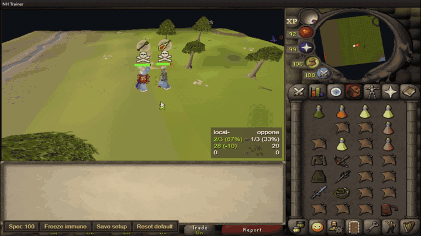

# NH Trainer

Browser-based NH practice with a trained AI opponent.

Live site: [nh-train.com](https://nh-train.com)

<p align="center">
  
</p>

NH Trainer is a free, unofficial fan/practice project. It is not a real game
client, does not connect to the live game, does not use player accounts, and is
not endorsed by or affiliated with Jagex.

Created using intellectual property belonging to Jagex Limited under the terms
of Jagex's Fan Content Policy. This content is not endorsed by or affiliated
with Jagex.

## What It Is

NH Trainer gives players a private practice partner for NH fights. The opponent is a trained policy, not a scripted rotation: it reacts to the fight state and chooses gear, prayers, movement, supplies, attacks, and special attacks through the same game loop the player uses.

The project is still a work in progress. The goal is to make useful NH practice available in the browser while continuing to improve the bot, the fight flow, and the client feel.

## AI Opponent

The opponent is trained through self-play on mirror NH fights. Each tick, it reads the current fight state and chooses a combined action: attack style, defensive prayer, movement, supplies, gear handling, and special-attack intent.

The policy does not only look at the current frame. It encodes the live inputs into a small rolling memory of recent fight states, so delayed outcomes can still be learned. For example, if a freeze, stand-under attempt, gear switch, eat timing, or special-attack setup pays off a few ticks later, training can connect that reward to the earlier state sequence instead of treating it as a random event.

The bot observes practical NH context, including:

- distance, relative position, movement history, line-of-sight pressure, freeze timers, and whether either player can currently act or attack;
- both players' health, prayer, food, brew, restore, and offensive potion state;
- active overhead prayers, likely opponent style, recent hits dealt or taken, attack cooldowns, and special energy;
- current weapon, visible equipment bonuses, offensive level boosts or drains, and whether melee, ranged, magic, or special attacks are actually available;
- tactical movement options such as pressuring, stepping under a frozen opponent, stepping out diagonally, or repositioning around the target.

Gear decisions are based on the equipment and weapon stats available in the fight, not just hard-coded item names. The runtime evaluates visible offensive and defensive bonuses, weapon profiles, protection prayers, distance, freeze state, and attack availability so the bot can decide when mage, ranged, melee, or a defensive/offensive gear adjustment is worth using.

Special attacks are part of the action space. The policy can choose normal pressure, single-special windows, double-special windows where supported, and approach timing for melee special attacks. It still has to pass the same game-state gates as a player: weapon, energy, range, cooldown, movement, and target availability all matter.

Difficulty modes are frozen training checkpoints from the same self-play run:

- Easy: 5 minutes of training.
- Medium: 15 minutes of training.
- Hard: 40 minutes of training.

The bot is not meant to be omniscient. It should act from the information available in the fight state, with reaction timing kept fair for practice.

## Player Settings

The browser stores local profile settings such as client size, F-key mappings, inventory setup, equipment setup, attack styles, auto-retaliate, XP-drop settings, and selected difficulty. Different visitors keep their own settings in their own browser storage.

## Running Locally

```powershell
npm install
npm run dev
```

For a production web build:

```powershell
npm run build:web
npm run preview
```

## Deployment

The project is set up for Vercel. The deployment config builds the static web client from `dist`.

```powershell
npm run build:web
```

## License

The project code written for NH Trainer is available under the MIT License.

That license does not apply to third-party game assets, cache-derived assets,
game names, trademarks, trade dress, or other material owned by Jagex or any
other third party. Those materials remain the property of their respective
owners and are included or referenced only for the free fan/practice project.

## Current Focus

- Keep the fight loop responsive and tick-accurate.
- Improve the trained opponent across the Easy, Medium, and Hard checkpoints.
- Add useful post-fight feedback without turning the client into a workbench.
- Keep browser settings stable across updates.
