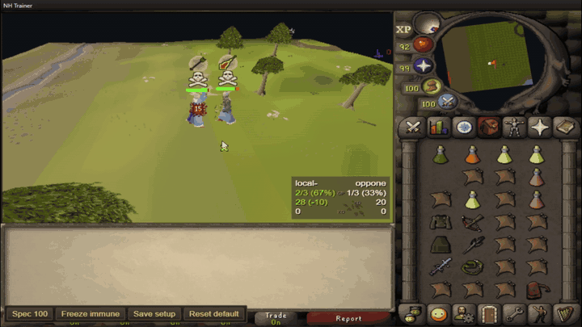

# NH Trainer

Browser-based NH practice with a trained AI opponent.

Live site: [nh-train.com](https://nh-train.com)

<p align="center">
  
</p>

NH Trainer is a free, unofficial fan/practice project. It is not a real game
client, does not connect to the live game, does not use player accounts, and is
not endorsed by or affiliated with Jagex.

Created using intellectual property belonging to Jagex Limited under the terms
of Jagex's Fan Content Policy. This content is not endorsed by or affiliated
with Jagex.

## What It Is

NH Trainer gives players a private practice partner for NH fights. The opponent is a trained policy, not a scripted rotation: it reacts to the fight state and chooses gear, prayers, movement, supplies, attacks, and special attacks through the same game loop the player uses.

The project is still a work in progress. The goal is to make useful NH practice available in the browser while continuing to improve the bot, the fight flow, and the client feel.

## AI Opponent

The public client exposes one opponent difficulty: Hard. The selected setup decides which neural model is used:

- NH stake Hard: `fixtures/ai/nh-neural-policy-hard.json`. The public browser build may serve large model fixtures through `part-*` chunks so no deployed asset exceeds Vercel's per-file limit. Read the fixture schema directly when exact input/action counts matter.
- DMM Hard in the public browser build: `fixtures/ai/nh-neural-policy-dmm-current.json` — the v26 teacher165 "ranged multi-gear prayer" checkpoint (114 inputs, 86 actions, conditioned v10 schema with 16 prior-state lags), selected by the Elo league in August 2026. The previous deployed model remains at `fixtures/ai/nh-neural-policy-dmm-candidate.json` (with its `.chunk-*` parts) for local rollback comparisons. Treat playable artifacts as deployment targets, not automatically as current training predecessors, and read their schemas before reusing them.
- DMM deployed-composite hard in Java practice: the 92-input, 21,906-action browser-deployed model referenced by `server.practice.dmm.deployed.properties`. This is the rollback/playable deployed-hard brain and must use the deployed-composite controller semantics, not the newer direct-action training controller.

The opponent is trained through self-play on mirror fights. Each tick, it reads the current fight state and chooses a combined action: attack style, defensive prayer, movement, supplies, gear handling, and special-attack intent.

The policy does not only look at the current frame. It encodes the live inputs into a small rolling memory of recent fight states, so delayed outcomes can still be learned. For example, if a freeze, stand-under attempt, gear switch, eat timing, or special-attack setup pays off a few ticks later, training can connect that reward to the earlier state sequence instead of treating it as a random event.

The bot observes practical NH context, including:

- distance, relative position, movement history, line-of-sight pressure, freeze timers, and whether either player can currently act or attack;
- both players' health, prayer, food, brew, restore, and offensive potion state;
- active overhead prayers, likely opponent style, recent hits dealt or taken, attack cooldowns, and special energy;
- current weapon, visible equipment bonuses, offensive level boosts or drains, and whether melee, ranged, magic, or special attacks are actually available;
- tactical movement options such as pressuring, stepping under a frozen opponent, stepping out diagonally, or repositioning around the target.

Current DMM training is separate from deployed-composite hard. New DMM training must use the v5 same-tick action-vector path with explicit action IDs for combat/spec, prayer, supply, movement, and direct item/slot gear actions. Current direct-action channel IDs are dedicated rows after the direct-gear range, not reused dummy composite IDs. It should learn item-level gear behavior through outcomes instead of Java helpers that choose "best mage shield", "best range body", generic best-special weapons, or EV style overrides.

The deployed-composite hard bot is older but still valid as a playable/rollback artifact. Do not migrate it by guessing. Java practice for that bot should load the 92-input deployed model, enforce `dmm_deployed_composite` decode, keep exploration off, keep fallback disabled, and preserve the deployed-era controller behavior that the browser hard bot was built around.

For plug-and-play model setup, treat the model schema as the router. The deployed-composite DMM model must stay on the `dmm_deployed_composite` bridge: 92 inputs, explicit `schema.actionIds`, all mapped actions inside the deployed legacy action range, and the deployed DMM inventory surface. Current/new DMM models must use the v5 action-vector bridge instead. Do not let either surface silently fall back to the other.

Training rollouts keep one row per real bot decision/tick. Same-tick direct gear choices are stored as labels on that row so the model can learn multiple gear actions in one tick without inventing fake intermediate ticks.

Useful verifier commands for this split:

```powershell
npm run verify:dmm-deployed-composite-java
npm run verify:dmm-deployed-composite-java:runtime
npm run verify:dmm-deployed-composite-java:live
npm run verify:dmm-deployed-composite-java:probe
```

The `:live` variant should be run after at least one real Java practice fight exchange has happened. It requires deployed-composite decision lines, prayer-state timing lines, and applied-state attack lines in the NH staker log, so startup-only evidence cannot pass as a working combat check.

The base verifier now checks more than property wiring: it decodes every mapped action ID in the deployed model against the browser decoder, confirms the deployed DMM inventory/spec/trinket surface, checks fail-closed model loading, and guards the one-tick prayer/facing hooks. The live/probe checks must also see an actual delayed-prayer sample where the bot resolves protection from delayed visible threat instead of the same-tick live threat.

The `:probe` variant starts a temporary Java server on a separate local port with deployed-hard-vs-deployed-hard autoduel enabled, waits for real fight evidence, verifies the exact probe log, and shuts the temporary server down. It must see multiple deployed-composite decisions, attacks, prayer switches, style variety, applied weapon variety, runtime facing-target checks, a real delayed-prayer-vs-live-threat disagreement resolved the delayed way, and no deployed-composite feature-input outliers or stale controller markers. Use it when you need proof that Java deployed-composite combat decisions are actually being applied without using the playable client.

Special attacks are part of the action space. The policy can choose normal pressure, single-special windows, double-special windows where supported, and approach timing for melee special attacks. It still has to pass the same game-state gates as a player: weapon, energy, range, cooldown, movement, and target availability all matter.

The bot is not meant to be omniscient. It should act from the information available in the fight state, with reaction timing kept fair for practice.

## How the current DMM model was chosen

Since August 2026 the DMM opponent is selected with an Elo league instead of small matched screens. The league lives in `fastsim/` (see `tools/evaluate_elo_league.py` there): every compatible checkpoint and scripted opponent plays one complete fight against every other entrant (313 entrants - 272 checkpoints plus 41 scripted opponents - and 48,828 fights), classic Elo with K=32, exploration off, seeded-human prayer defence, and both 1-tile and 8-tile openings on world 35.

The current deployed model is teacher165, which finished 3rd in that league:

- 1st - teacher139-no-opponent-prayer-all - 1890.6
- 2nd - teacher111-prayer-vlsordinary-from110-alpha075 - 1833.3
- 3rd - teacher165-ranged-multigear-prayer-from154 - 1797.2
- 4th - teacher116b-safe-ward-from116a - 1792.9
- 5th - lr050-ancestry20-r01 - 1790.4

The league leader is a no-opponent-prayer ablation: it wins on raw expected damage (95.4 per fight) but only reads prayer 52% of the time. teacher165 was chosen because it is the most balanced of the top three: 84.9% prayer correctness (best of the top five), a 91.1 expected-damage edge per fight, the best realized edge of the top three (+94.6), and a balanced attack mix (66% magic / 13% ranged / 21% melee). It is also the newest line with a verified browser contract: `reports/teacher165-java-browser-policy-boundary-parity.json` replays real Java fight snapshots through both Java and browser inference and passes within 1e-5 score tolerance.

## GPU fight engine (fastsim)

The `fastsim/` folder is the GPU fight engine used to generate training rollouts, run paired evaluations, and run the Elo league without booting the game server. It targets the same combat maths, 114 inputs, 86 actions, NHRL-v25/v26 rows, and NHEV reward events as Java self-play, with the CPU running fight rules and the GPU scoring every bot in a batch. Java remains the promotion authority; `fastsim/docs/PARITY.md` lists which mechanics are verified, measured, or approximated. The retained seeded replay gate is `fastsim/tools/replay_gate.py`.

## Player Settings

The browser stores local profile settings such as client size, F-key mappings, inventory setup, equipment setup, attack styles, auto-retaliate, XP-drop settings, and setup selection. Different visitors keep their own settings in their own browser storage.

## Running Locally

```powershell
npm install
npm run dev
```

For a production web build:

```powershell
npm run build:web
npm run preview
```

## Deployment

The project is set up for Vercel. The deployment config builds the static web client from `dist`.

```powershell
npm run build:web
```

## License

The project code written for NH Trainer is available under the MIT License.

That license does not apply to third-party game assets, cache-derived assets,
game names, trademarks, trade dress, or other material owned by Jagex or any
other third party. Those materials remain the property of their respective
owners and are included or referenced only for the free fan/practice project.

## Current Focus

- Keep the fight loop responsive and tick-accurate.
- Improve the setup-specific Hard neural opponents, selected with Elo evidence rather than single matched screens.
- Keep the deployed model's Java/browser parity gates passing for every release.
- Expand the fastsim replay matrix and scripted cohorts; Java remains the promotion authority.
- Keep browser settings stable across updates.
